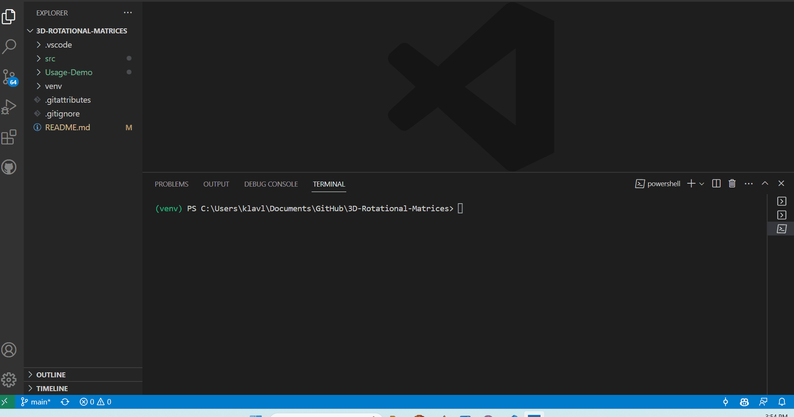
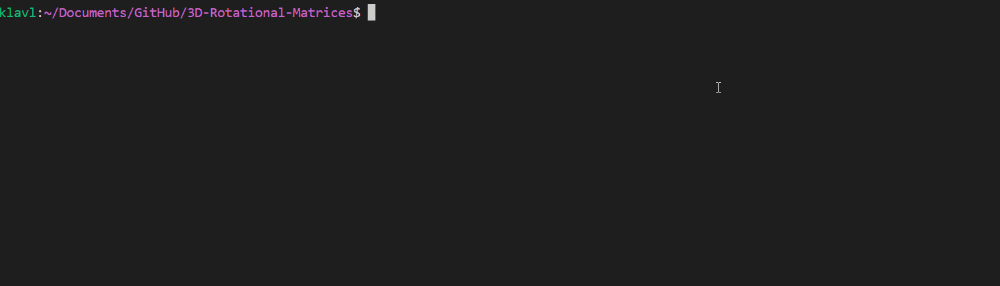
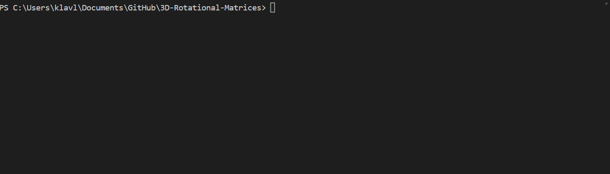

# Rotational Matrix Project

  

This is my project for Mathematical Models in Linear Algebra, where I explore the use of 3D Matrices using my library, rubato. The project comprises a gimbal locking demo that explains the phenomenon, alongside slides and a video detailing the mathematical processes involved in the project's implementation.

[_SKIP TO THE INSTALLATION GUIDE_](#installation)
[_SKIP TO ACCOMPANYING SLIDES AND VIDEO_](#accompanying-slides-and-video)

## Background

Rotational matrices are mathematical constructs that describe the rotation of objects in three-dimensional space. They can be used to define the orientation of an object and to rotate an object about a specific axis.

## The Cube and Donut

The project features two objects: a cube and a donut. The cube was created using 3D modeling software, while the donut was generated using Matlab. The objects were then exported in a format compatible with the programming language used in the project.

## Rotational Matrices

The rotational matrices formed the foundation of the project's ability to spin the cube and donut around different axes. The process involved the calculation of a transformation matrix for each rotation and applying the transformation to the object's vertices. The transformed vertices were then rendered to display the rotated object.

Check it out [here](./src/python-rot/general_python_rots/get_rot_matrices.py)!

## Gimbal Locking Demo

The project includes a demo that explains the phenomenon of gimbal locking. Gimbal locking is the loss of one degree of freedom in rotation that occurs when the rotational axes of an object align. The demo uses a straightforward example to illustrate the occurrence of gimbal locking and demonstrates how quaternions can help to avoid it.

Try it out [here](./src/python-rot/general_python_rots/gimbal_tutorial.py)!

## Accompanying Slides and Video

These [slides](https://docs.google.com/presentation/d/1S6Tq5zvRbTNgvMFwpLw_Dwiy8rMKnze3SVTjfmKySYc/edit?usp=sharing) describe the mathematical processes involved in the project's implementation.

This YouTube [video](https://youtu.be/S26etodkbBY) provides a walkthrough of the project's features and thoughts on the project's implementation.

## Conclusion

The Rotational Matrix Project showcases the use of rotational matrices in manipulating objects in three-dimensional space, including a cube and donut. The gimbal locking demo and accompanying slides and video provide a thorough exposition of the mathematical processes involved in the project. The project has potential applications in areas such as game development, computer graphics, and robotics.

## Installation

1. Make a virtual environment \*If you want to:
   

2. You must install rubato:
   

Improvements:

- Repl.it demo.
- Linux C support
- Enhance the gimbal tutorial, adding colors to the different axes zero markers.
- Use matrix multiplication and possibly create a shader for the GPU, instead of pixel by pixel computation.
